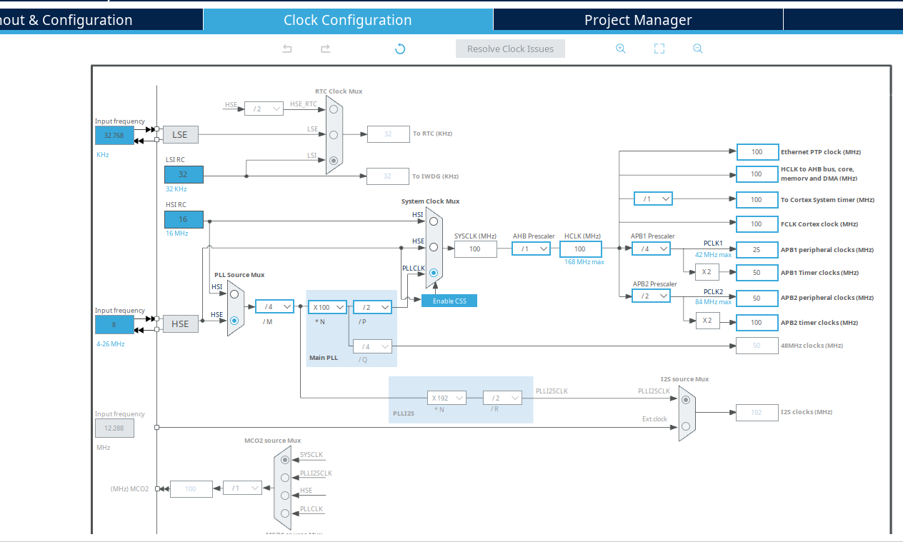
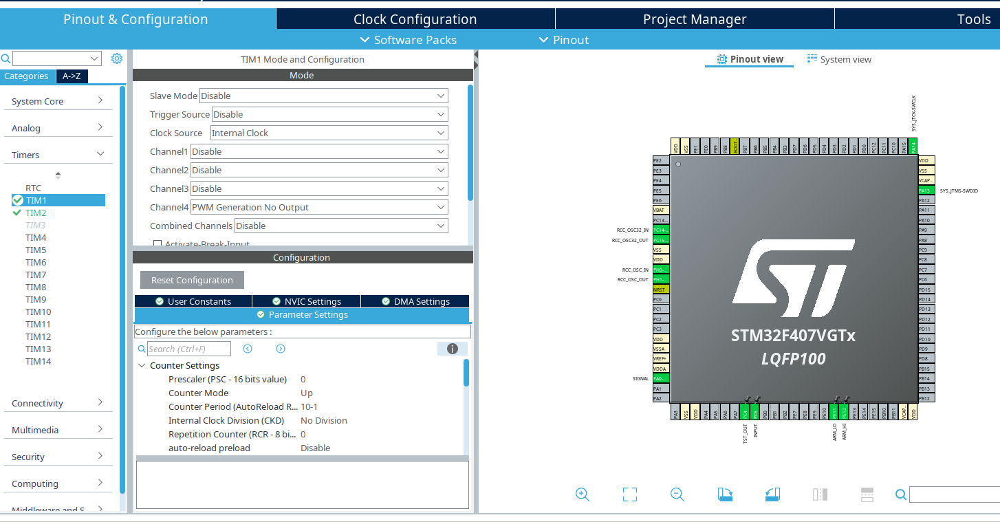
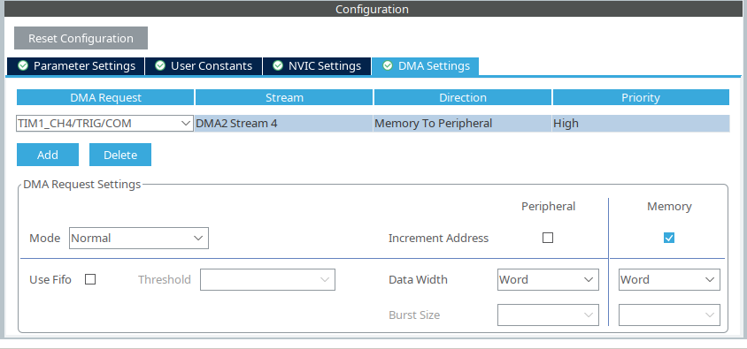
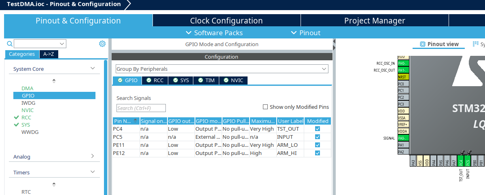
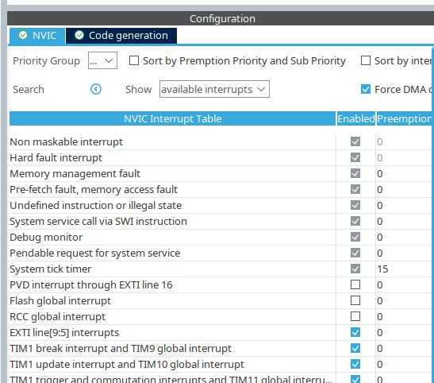
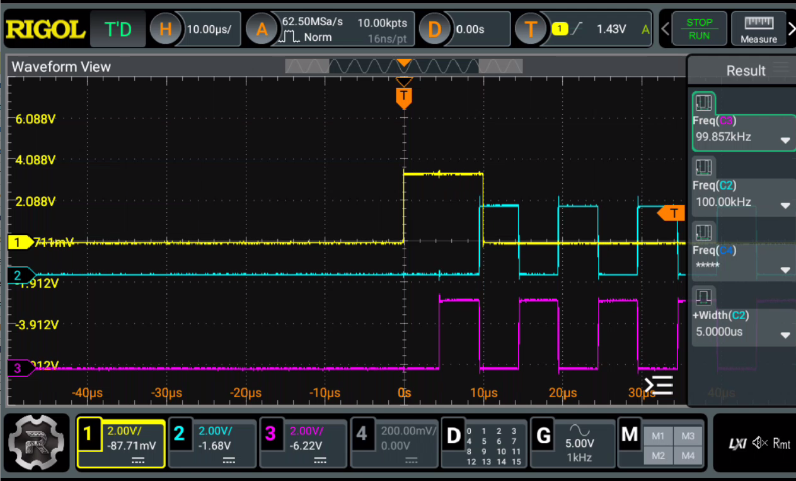

# Это пример передачи данных из DMA в порт GPIO
## Задача
1. При поступлении сигнала на пин PC4, запустить генерацию сигнала из памяти в GPIO с тактированием от таймера TIM1 по четвёртому каналу с синхронизацией по событию PWM.
2. Частота семплирования сигнала &mdash; 10 МГц
3. Использовать регистр BSRR GPIOE и настроить на выход пины PE11, PE12
4. Софтварно запустить передачу данных на настроенные пины

*Примечание*: Можно было бы использовать режим One Short Pulse, но ```Repetition Counter (RCR - 8 bits value) must be between 0 and 255.```, а количество точек в массива = 16636.

## Введение

В этом примере используется HAL, запуск передачи &mdash; софтварный (по функции обратного вызова GPIO)

Оптимальная скорость передачи для STM32F4xx на AHB около 10 МГц
DMA передаёт данные на GPIO через регистр BSRR, позволяя устанавливать или сбрасывать отдельные пины порта. Скорость передачи данных напрямую зависит от частоты срабатывания DMA. Если не использовать таймер, частота будет определяться системным тактированием и задержками самого DMA.
Проблемы с максимальной скоростью

### Ограничения DMA:
Максимальная частота работы DMA ограничена его архитектурой. Для STM32F4xx теоретический предел составляет около 12-15 млн операций в секунду для потоковой передачи данных.
На практике это зависит от системной шины (AHB), размера данных, и конкуренции за доступ к памяти.

### GPIO:
GPIO на STM32F4xx может работать на частотах до 84 МГц (при настройке на максимальную скорость). Однако передача данных через BSRR ограничивается частотой DMA.

## Настройки
### В CubeMX:
#### Настройка системного таймера

1. HCLK Настроен на 100 МГц:


2. В TIM1 активируется 4 канал PWM (Без генерации сигнала)
3. Прескалер 0, счётчик 10-1. Таким образом, получится частота 10МГц на порту GPIO



#### Настройка DMA

Включить DMA c синхронизацией по событиям PWM 4 канала:
1. Настройка GPIO. В CubeMX, на вкладке Pinout & Configuration:
	- Настроить выводы PE11, PE12 как Output.
	- Пины порта, выберите GPIO_Output.
	- Если все пины используются для передачи, можно выбрать All Output.
	- На вкладке System/GPIO/:
	- Скорость GPIO (например, High speed).
	
2. Настройка таймера TIM1
	- Clock Source: Internal Clock
	- Channel 4: PWM generation No output
	- Prescaler для задания частоты таймера -- 0.
	- Counter Period для управления периодом передачи 10-1.
	- Во вкладке DMA Settings для таймера:
3. Настройка DMA
	- На вкладке DMA: новый DMA2_Stream4.
	- Mode: Memory-to-Peripheral.
	- Priority: High.
	- Peripheral Increment: Disabled.
	- Memory Increment: Enabled.
	- Peripheral Data Width: Word (32 бит).
	- Memory Data Width: Word (32 бит).
	- FIFO mode: Disabled.



Ширина данных DMA &mdash; WORD, т.е., инкремент данных в памяти на 32 бита &mdash; ```uint32_t```. Таким образом можно отправлять данные на весь порт, например, GPIOE. Однако, благодаря использованию регистра BSRR можно отправлять и на определённые пины, скажем PE11, PE12, не затрагивая другие.

#### Настройка GPIO




И не забыть включить прерывание на PC4 (EXTI line[9:5] interrupts)




## Настройка массива данных
Чтобы включить PE11, надо установить
```c
1ULL << 0x10
```
Чтобы выключить PE11, надо установить (сдвинуть на 16 бит == 0x10)
```c
1ULL << (12 + 0x10)
```
Таким образом, получается функция инициализации
```c
static void s_data_init(void)
{
	uint8_t flag = 0;
	for (uint32_t i = 0; i < DATA_SIZE; i++)
	{
		s_data[i] = (1ULL << (11 + 0x10)) | (1ULL << (12 + 0x10));
		if (i % 50 == 0) flag ^= 1;

		if (i >= 100 && i < 600)
		{
			s_data[i] = flag ? (1ULL << (11 + 0x10)) | (1ULL << (12)) : (1ULL << (11)) | (1ULL << (12 + 0x10));
		}
	}
	s_data[DATA_SIZE - 1] = (1ULL << (11 + 0x10)) | (1ULL << (12 + 0x10));
}
```
Начиная с отметки в 10us (сто тактов) каждые 50 тактов (5us) полярности пинов PE11 и PE12 меняются
Начиная с 60 us генерация сигнала на пинах PE11 и PE12 прекращается.
Соответственно, можно настроить любые пины GPIOE.

## Инициализация таймеров TIM1, TIM2
Осталось запустить таймер TIM1 для синхронизации отправляемых данных по DMA и TIM2 для генерации тестового сигнала:

```c
  // Запуск таймера синхронизации канала DMA для передачи данных
  if (HAL_TIM_PWM_Start(&htim1, TIM_CHANNEL_4) != HAL_OK)
  {
	  Error_Handler();
  }

  // Таймер 2 выдаёт короткий сигнал, который коммутирется на PC4
  // И запускает передачу по DMA
  if (HAL_TIM_PWM_Start(&htim2, TIM_CHANNEL_1) != HAL_OK)
  {
	  Error_Handler();
  }
```

## Функция запуска передачи DMA
Важно обязательно проверять состояние ```hdma_tim1_ch4_trig_com``` и если канал занят, сбросить его. Иначе, повторной генерации не будет!
```c
void s_start_dma_transfer (void)
{
	if (HAL_DMA_GetState(&hdma_tim1_ch4_trig_com) != HAL_DMA_STATE_READY)
	{
		if (HAL_DMA_Abort(&hdma_tim1_ch4_trig_com) != HAL_OK)
		{
			Error_Handler ();
		}
	}

	if (HAL_DMA_Start(&hdma_tim1_ch4_trig_com, (uint32_t)s_data, (uint32_t) &GPIOE->BSRR, DATA_SIZE) != HAL_OK)
	{
		Error_Handler();
	}

	__HAL_TIM_ENABLE_DMA(&htim1, TIM_DMA_CC4);
	__HAL_TIM_ENABLE(&htim1);
}
``` 
## Запуск по прерыванию
### Таймер, генератор сигнала: 
1. TIM2, Channel 1, PWM Generation Channel 1
2. Прескаллер &mdash; 500-1, счётчик &mdash; 200-1.
3. Счётчик PWM (Pulse): 1.
Таким образом, на PA0 получится импульс с частотой 2 мс, шириной 5 us.
Осталось настроить прерывание на вход на пине PC5 и соединить их проводом

### Прерывание от пина:
1. Настроен пин PС5 (9:5) на прерывание по фронту (RISING EDGE).
2. При обнаружении сигнала на пине вызывается HAL_GPIO_EXTI_Callback.

#### Обработчик прерывания:
В обработчике ```HAL_GPIO_EXTI_Callback``` ([main.c](Core/Src/main.c)) вызывается функция ```Start_DMA_Transfer``` ([pulse.c](Core/Src/pulse.c)):

```c
void HAL_GPIO_EXTI_Callback(uint16_t GPIO_Pin)
{
  if(GPIO_Pin == INPUT_Pin) {
		Start_DMA_Transfer();
  } else {
      __NOP();
  }
}
```

#### Функция ```Start_DMA_Transfer```:
Проверяет состояние DMA. Если оно занято, выполняет остановку текущей передачи с помощью ```HAL_DMA_Abort```.
Перезапускает передачу данных из массива dma_data в регистр ```GPIOE->BSRR```.

### Итог
На осцилограмме хорошо виден результат генерации сигнала.
Расстояние между поступлением сигнала и запуском передачи DMA -- 4us.
1. 1й канал (жёлтый) &mdash; входной сигнал от PC5
2. 2й канал (голубой) &mdash; выходной сигнал от PE11
3. 3й канал (фиолетовый) &mdash; выходной сигнал от PE12


